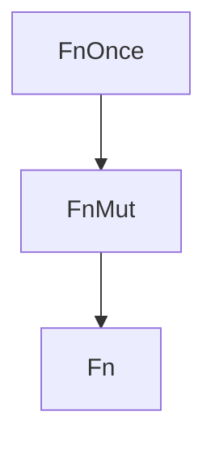

# 一、闭包的基础概念

## 闭包

闭包是一种可以捕获其环境中变量的匿名函数

闭包的语法相对简洁灵活，同时也具有强大的功能。闭包在 Rust 中被广泛用于函数式编程、并发编程以及简化代码等方面


## 如何使用闭包

定义闭包的语法类似（但更简单）

- 在 `||` 内定义参数
- 可选地指定参数 / 返回类型
- 在 `{}` 内定义闭包体

你可以将闭包分配给一个变量

- 然后使用该变量，就像它是一个匿名函数，来调用闭包

```rust
#[derive(Debug)]
struct User {
    name: String,
    score:u64,
}

// 排序
// sort_by_key()
fn sort_score(users: &mut Vec<User>){
    users.sort_by_key(sort_helper)
}

fn sort_helper(u: &User) -> u64{
    u.score
}

// -------------------
fn sort_score_closures(users: & mut Vec<User>){
    users.sort_by_key(|u|u.score); // 自动推导
}
fn main(){
    let a = User{name:"U1".to_owned(),score:100};
    let b = User{name:"U2".to_owned(),score:32};
    let c = User{name:"U3".to_owned(),score:54};
    let d = User{name:"U4".to_owned(),score:70};
    let e = User{name:"U5".to_owned(),score:93};

    // User
    let mut users = vec![a,b,c,d,e];
    sort_score(&mut users);
    println!("{:#?}",users);
    // [
    //     User {
    //         name: "U2",
    //         score: 32,
    //     },
    //     User {
    //         name: "U3",
    //         score: 54,
    //     },
    //     User {
    //         name: "U4",
    //         score: 70,
    //     },
    //     User {
    //         name: "U5",
    //         score: 93,
    //     },
    //     User {
    //         name: "U1",
    //         score: 100,
    //     },
    // ]
    //--------------


    // 闭包的方法
    // let f = |a,b| a + b; //  type must be known at this point
    // 单独使用会报错

    // 调用一次，可以自动推导
    let f = |a,b| a + b; // 被下面的调用自动推导了
    println!("{:?}",f(1,2));
    // 3
    // ----------------

    let f = User{name:"U1".to_owned(),score:100};
    let i = User{name:"U2".to_owned(),score:32};
    let j = User{name:"U3".to_owned(),score:54};
    let k = User{name:"U4".to_owned(),score:70};
    let l = User{name:"U5".to_owned(),score:93};
    let mut users2 = vec![f,i,j,k,l];
    sort_score_closures(&mut users2);
    println!("{:#?}",users2);
    // [
    //     User {
    //         name: "U2",
    //         score: 32,
    //     },
    //     User {
    //         name: "U3",
    //         score: 54,
    //     },
    //     User {
    //         name: "U4",
    //         score: 70,
    //     },
    //     User {
    //         name: "U5",
    //         score: 93,
    //     },
    //     User {
    //         name: "U1",
    //         score: 100,
    //     },
    // ]
}
```


# 二、闭包获取参数 by reference 与 by value

## 获取外部参数

由 Rust 编译器决定用哪种方式获取外部参数

1. 不可变引用 Fn
2. 可变引用 FnMut
3. 转移所有权（Move） FnOnce


## 所有权转移 Move

Rust 编译器判断 captures by value

比方说在闭包手动 drop 该参数

move 关键字强制将所有权转移到闭包

```rust

fn main(){
    // 不可变引用获取外部参数
    let s1 = String::from("1111111111111");
    let s2 = String::from("2222222222222");
    // 自动实现不可变引用
    let fn_func = |s|{
        println!("s1 is {}",s1);
        println!("I am {s}");
        println!("s1 is {}",s1);
    };
    // 可以调用两次
    fn_func("STR".to_owned());
    // s1 is 1111111111111
    // I am STR
    // s1 is 1111111111111
    fn_func("字符".to_owned());
    // s1 is 1111111111111
    // I am 字符
    // s1 is 1111111111111
    println!("s1:{s1} \ns2: {s2}");
    // s1:1111111111111
    // s2: 2222222222222

    println!("可变引用");
    // 可变引用
    // FnMut 可变引用获取外部参数
    let mut s1 = String::from("1111111111111");
    let mut s2 = String::from("2222222222222");
    // 自动实现可变引用
    let mut fn_func = |s|{
        s1.push_str("string");
        s2.push_str("string");
        println!("s1 is {}",s1);
        println!("I am {s}");
        println!("s1 is {}",s1);
    };
    // 可以调用两次
    fn_func("STR".to_owned());
    // s1 is 1111111111111string
    // I am STR
    // s1 is 1111111111111string
    fn_func("字符".to_owned());
    // s1 is 1111111111111stringstring
    // I am 字符
    // s1 is 1111111111111stringstring
    println!("s1: {s1} \ns2: {s2}");
    // s1: 1111111111111stringstring
    // s2: 2222222222222stringstring

    println!("所有权转移");
    // 所有权转移 由编译器根据代码来判断
    let s1 = String::from("1111");
    let fnOnce_func = ||{
        println!("{s1}");
        std::mem::drop(s1);
    };
    // 只能调用一次
    fnOnce_func();
    // fnOnce_func(); // 调用第二次报错：value used here after move
    // println!("s1 is {s1}"); // 已经在闭包中销毁了，无法访问：value borrowed here after move

    // 强制
    let s1 = String::from("1111");
    let move_fn = move ||{
        println!("{s1}");
    };// Fn : FnMut : FnOnce
    move_fn();
    move_fn();
    // println!("{s1}"); //  s1 已经被强制销毁了：value borrowed here after move

    // 线程
    let s1 = String::from("1111");
    // std::thread::spawn(move || println!("{s1}")); // 在子线程中无法确定 s1 还在，所以需要 move 过去

}
```


# 闭包在底层是怎么工作的

1. Rust 编译器将闭包放入一个结构体
2. 结构体会声明一个 call function，而闭包就是函数，call function 会包含闭包的所有代码
3. 结构体会产生一些属性去捕获闭包外的参数
4. 结构体会实现一些特质：
    - FnOnce
    - FnMut
    - Fn


## FnOnce、FnMut、Fn特质



FnOnce：Move 所有权转移，只实现  FnOnce

FnMut：可变引用，实现了FnOnce 和FnMut

Fn：不可变引用，实现了 FnOnce、FnMut 和 Fn


```rust
fn apply_closure<F:Fn(i32,i32) -> i32>(closure:F,x:i32,y:i32) -> i32 {
    closure(x,y)
}
fn main(){
    let x = 5;
    let add_closure = |a,b|{
        println!("x is: {}",x);
        a + b + x
    };
    let result = apply_closure(add_closure,5,6);
    println!("{}",result);
    // x is: 5
    // 16
}
```


# 闭包类型 FnOnce、FnMut 和 Fn 做函数参数的实例


```rust
use std::arch::aarch64::vuqadds_s32;

fn closure_fn<F>(func: F) // 不可变推荐使用
    where
        F: Fn()
{
    func();
    func();
}

fn closure_fn_mut<F>(mut func: F)
    where
        F: FnMut()
{
    func();
    func();
}

fn closure_fn_once<F>(func: F)
    where
        F: FnOnce()
{
    func();
}
fn main(){
    // 不可变引用只能传一种
    let s1 = String::from("1111");
    closure_fn(||println!("{}",s1) );

    // 可变引用
    let s1 = String::from("1111");
    closure_fn_mut(||println!("{}",s1) );

    let mut s2 = String::from("2222");
    closure_fn_mut(|| {
        s2.push_str("str");
        println!("s2 is {}",s2)
    });
    println!("s2 is {}",s2);
    // s2 is 2222strstr


    println!("所有权转移");
    // FnOnce 所有权转移
    let s1 = String::from("1111");
    closure_fn_once(||println!("{}",s1) );
    // 1111

    let mut s2 = String::from("2222");
    closure_fn_once(|| {
        s2.push_str("str");
        println!("s2 is {}",s2)
    });
    println!("s2 is {}",s2);
    // s2 is 2222str
    // s2 is 2222str

    let s3 = "string".to_owned();
    closure_fn_once(move || println!("s3 is {s3}"));
    // println!("{s3}"); //  所有权已经转移了：value borrowed here after move
}
```


